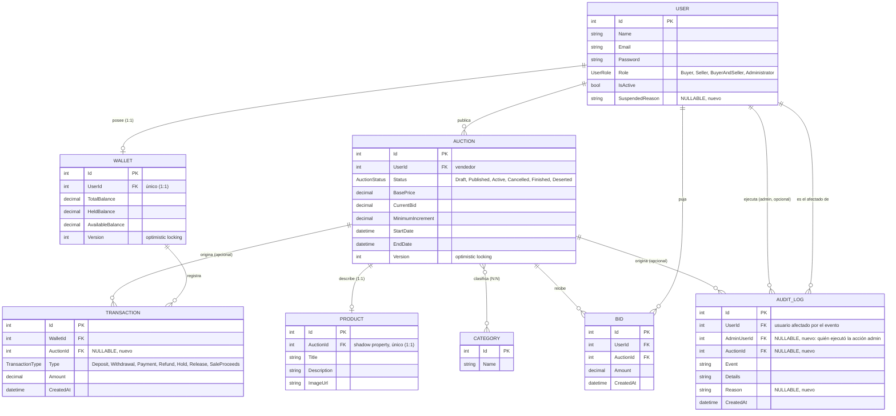

# Diagrama Entidad-Relación — SubastaYa

Generado a partir del código real (`Domain/Entities/*.cs` y `ApplicationDbContext.OnModelCreating`), no del diagrama sugerido del TP. Refleja el estado tras las 3 correcciones de auditoría/billetera/usuarios (ver abajo).

## Diagrama

> Nota sobre notación: `USER ||--o{ AUDIT_LOG` aparece dos veces (una por `UserId`, otra por `AdminUserId`) porque son dos relaciones independientes hacia la misma tabla, no una sola relación doble.

## Tablas y relaciones

| Entidad | Relaciones | Particularidad |
|---|---|---|
| **User** | 1:1 con Wallet · 1:N con Auction, Bid, AuditLog (x2) | `SuspendedReason` se limpia solo al reactivar la cuenta. |
| **Wallet** | 1:1 con User · 1:N con Transaction | `Version` para optimistic locking (RF de concurrencia). |
| **Transaction** | N:1 con Wallet · N:1 opcional con Auction | `AuctionId` null en depósitos manuales; presente en retención/liberación/pago/cobro por venta. |
| **Auction** | N:1 con User (vendedor) · 1:1 con Product · 1:N con Bid, Transaction, AuditLog · N:N con Category | `Version` para optimistic locking (pujas concurrentes). |
| **Product** | 1:1 con Auction | FK `AuctionId` es shadow property (no existe como campo explícito en la clase C#, solo en la configuración de EF). |
| **Category** | N:N con Auction | Tabla de unión autogenerada por EF Core (convención `AuctionCategory`). |
| **Bid** | N:1 con User · N:1 con Auction | Al eliminar un usuario, sus pujas no se borran en cascada (`DeleteBehavior.Restrict`). |
| **AuditLog** | N:1 con User (afectado) · N:1 opcional con User (admin) · N:1 opcional con Auction | Tabla de solo lectura/inserción (inmutable): nada la actualiza ni la borra. |

## Cambios recientes (los 3 puntos corregidos en esta conversación)

1. **`Transaction.AuctionId`** (nullable) + relación a `Auction`: liga cada movimiento contable a la subasta que lo originó, cuando corresponde.
2. **`User.SuspendedReason`** (nullable): motivo de la suspensión, visible mientras la cuenta sigue suspendida.
3. **`AuditLog.AuctionId`, `AuditLog.Reason`, `AuditLog.AdminUserId`** (los 3 nullable): separan del texto libre de `Details` la subasta afectada, el motivo ingresado y qué administrador ejecutó la acción.

Los tres son aditivos: solo agregan columnas nullable y relaciones nuevas hacia tablas existentes. Ninguna tabla, columna ni relación previa se modificó o se eliminó.
